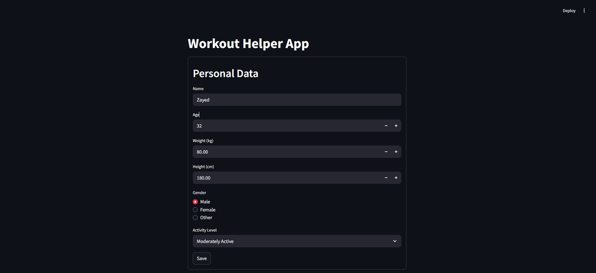
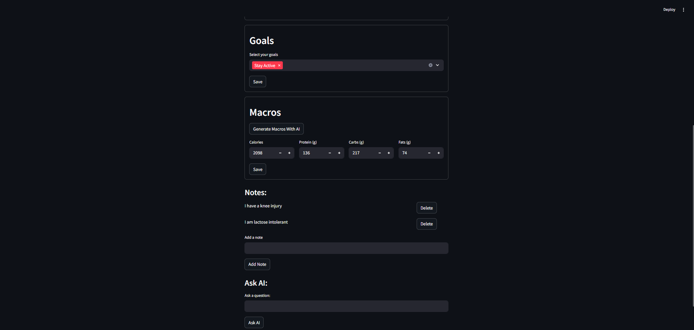
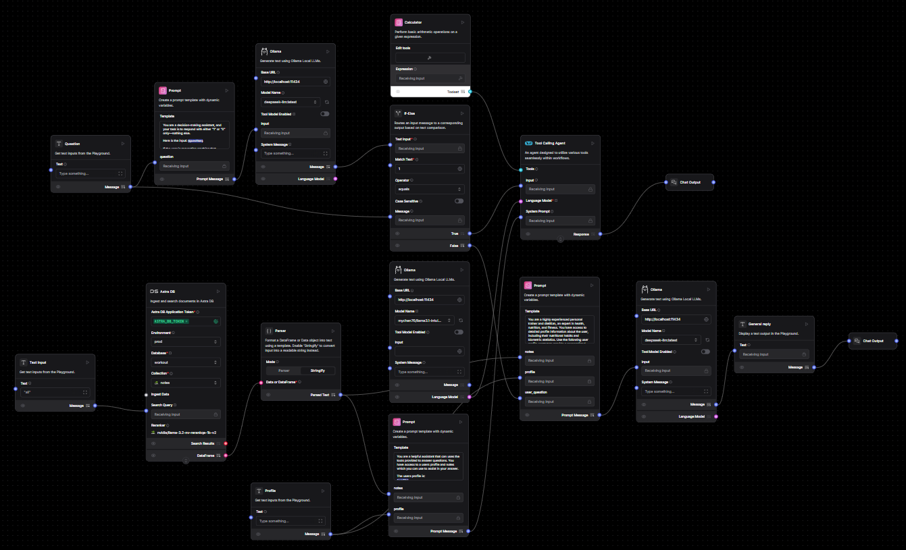
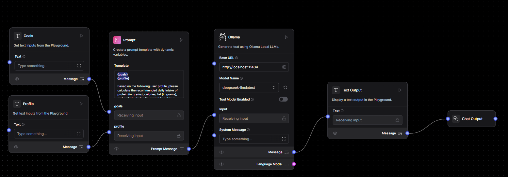

# 🏋️‍♂️ AI-Powered Fitness Companion  


A smart, interactive fitness companion powered by **Langflow**, **Ollama (Local LLMs)**, **Streamlit**, and **Astra DB**. Track your progress, manage personal health data, get personalized macro calculations, and interact with AI agents trained to support your fitness goals.


---

## 🚀 Features

- 🧠 **Ask AI Anything** – Talk to a smart fitness assistant powered by Langflow.
- 🧮 **Macro Calculator** – Automatically compute calories, protein, carbs, and fats based on your body metrics and goals using AI.
- 📋 **Personal Profiles** – Store and manage personal data like weight, height, age, gender, and activity level.
- 🎯 **Goal Tracking** – Choose fitness goals (e.g., Fat Loss, Muscle Gain).
- 🗒️ **Note Taking** – Add, view, and delete workout or meal-related notes.
- 💾 **Astra DB Integration** – Cloud-based database with vector-ready document storage.

---
## 🖼️ UI Screenshots

Here’s a preview of the app’s clean, responsive UI:


*Form for entering personal data.*

---


*Additional forms like notes, macro results, etc.*

---

## 🧠 Langflow AI Integration

This app uses two Langflow flows served via REST endpoints for AI-driven features:

### 1. AskAI Flow  
Processes user fitness questions and gives personalized responses.



---

### 2. CalculateMacros Flow  
Generates calorie and macro needs based on user profile data.



---


## 📁 Project Structure

```
app/
    ├── main.py # Streamlit frontend and user interface logic
    ├── ai.py # AI request handlers (Langflow: AskAI & MacroCalculator)
    ├── database.py # Astra DB client and collection setup
    ├── form_submit.py # Data updating and note insertion/deletion
    ├── profiles.py # User profile creation and retrieval
```
---


## 🛠️ Tech Stack

| Tech         | Description                         |
|--------------|-------------------------------------|
| 🟣 **Streamlit**| Frontend framework for rapid UI     |
| 🧠 **Langflow** | AI orchestration engine with flows  |
| 🌐 **Astra DB** | Cloud DB with document + vector support |
| 🐍 **Python**   | Primary language                    |
| 🖥️ **Ollama**   | Local LLM hosting for fast, private inference|

---

## 🔧 Setup Instructions

### 1. Clone the Repo

```bash
git clone https://github.com/AhmedZayed35/008_Multi_Agent_Workout_App_With_RAG
cd 008_Multi_Agent_Workout_App_With_RAG
```

### 2. Install Requirements
```bash
pip install -r requirements.txt
```

### 3. Set Up ```constants.py```
Create a file called constants.py and add your Astra DB credentials:
```
ASTRA_DB_TOKEN = "your_astra_db_token"
ASTRA_DB_ENDPOINT = "https://your-db-id-region.apps.astra.datastax.com"
```

### 4. Run the App
```
streamlit run main.py
```

## 📌 Developer Notes
- Notes are stored as vector-ready documents—future-proofed for advanced RAG applications.

- You can easily swap Langflow with other providers like OpenAI, Claude, or Cohere.

- Astra DB auto-scales and handles indexing behind the scenes.

- Ollama integration lets you run LLMs locally for privacy and speed.


## 📧 Contact
- 📫 Email: ahmed.kh.zayed@gmail.com
- 🔗 LinkedIn: [linkedin.com/in/ahmed--zayed](https://www.linkedin.com/in/ahmed--zayed/)

---